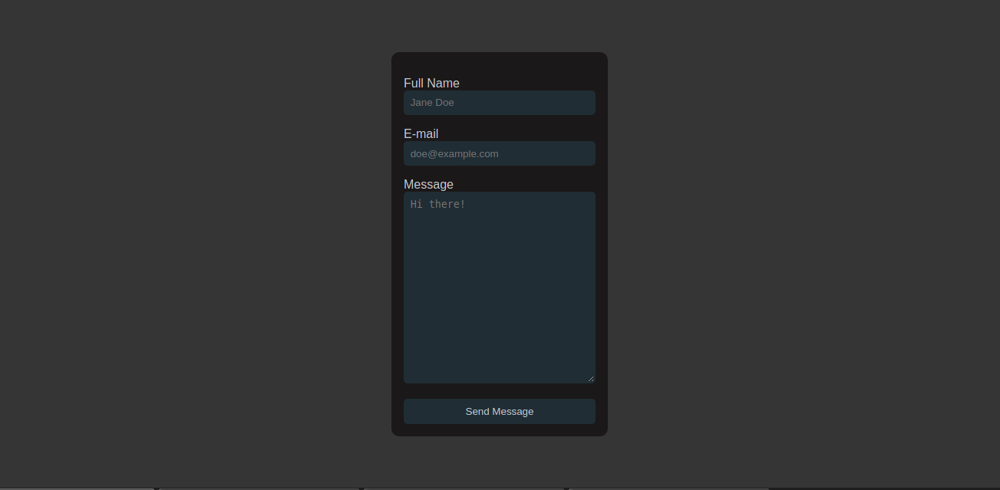

# netlify-sendGrid-demo-app

This is a simple demo which demonstrates how to send email using [event-driven netlify function](https://docs.netlify.com/functions/trigger-on-events/) and [sendGrid](https://sendgrid.com/) SMTP server.



## Running the app locally

Follow the steps below to run the app locally.

1. Clone this repository to your local machine using the command:

   ```sh
   git clone https://github.com/nibble0101/netlify-sendGrid-demo-app.git
   ```

   or

   ```sh
   git clone git@github.com:nibble0101/netlify-sendGrid-demo-app.git
   ```

2. Run the command `npm install` to install dependencies
3. Navigate to [sendgrid.com](https://sendgrid.com/) and sign up using your e-mail address
4. Verify your Single Sender Identity and create an API key
5. Create `.env` file at the root of this project directory. Paste the contents of `example.env` in the `.env` file you have just created
6. Set the value of `SENDGRID_API_KEY` environment variable to your sendGrid API key and the value of `SENDER_EMAIL` to your sender email address
7. Run the command `npm install netlify-cli -g` to install `netlify-cli` package
8. Run the command `netlify dev` to start the development server on port `8888`
9. Fill in the form and then submit. You should be able to see an email in your inbox if you followed the above steps correctly.

## License

[MIT](LICENSE)
